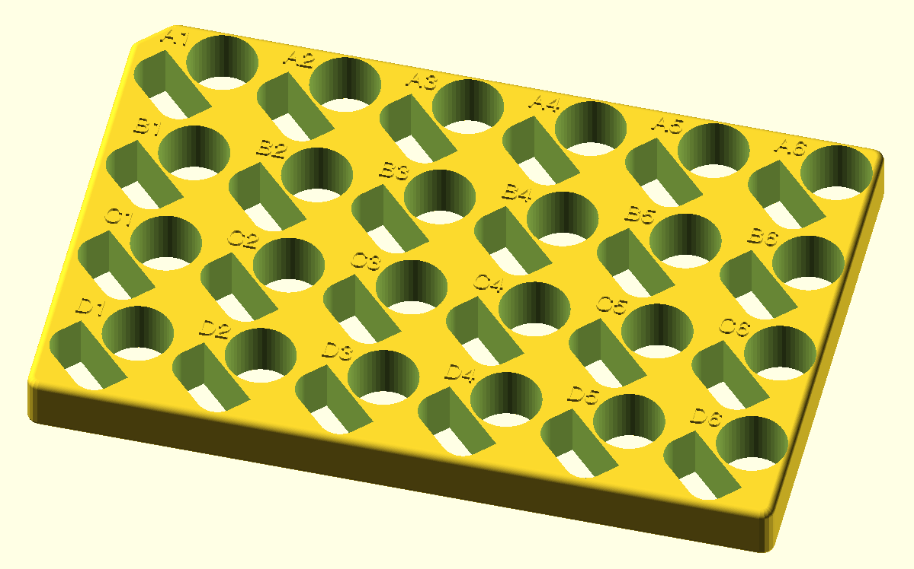

# Tube racks for the Opentrons 2

This tube rack holds a variety of tubes for the Opentrons 2 pipetting robot, using a collection of swappable plates.
It is an independent redesign of this [product](https://shop.opentrons.com/4-in-1-tube-rack-set/).

Dimensions from the [white paper](https://opentrons-landing-img.s3.amazonaws.com/labware/Opentrons_Tube_Rack_White_Paper.pdf)

### Customizer controls

The customizer can be used to select the print to be generated.

### 15 ml plate

### 50 ml plate

### 15 and 50 ml mix plate

### 1.5 ml plate with cap slots

### Stand

### Assembled view

_Note that the author of this work is not affiliated with Opentrons Labworks Inc._
