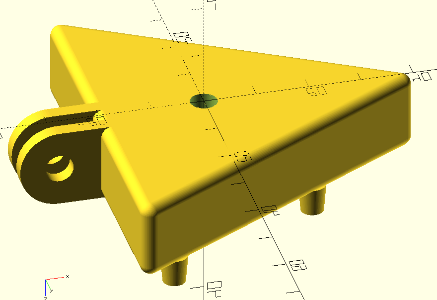

# Equipment for biology labs

This repository contains 3D printable parts for use in biology laboratories.

## Installation

Begin by cloning this repository and all its submodules using the following command:

````
git clone --recursive https://github.com/icaven/labware
````

Then use [OpenSCAD](https://www.openscad.org) to render files compatible with your 
printer's slicing software (such as .stl or .3mf).

Multi-nozzle suction head
-------

This part may be attached to a robot arm to pick up lids of petri dishes when connected to a 
vacuum pump.

The part has a [GoPro](https://www.thingiverse.com/search?q=gopro) compatible fitting 
 to join to the robot arm.

By default, the design has three nozzles, but this is customisable.


 

Bottom view

 

Cut away view showing air channel

 

Top view

Print settings
----

The multi-nozzle was printed with the default parameter values using about 17 grams of PLA filament, at a layer height
of 0.15 mm and infill of 15%.  The heated bed temperature was 62 C for the first layer and 60 C afterwards.  The print
time was 1 hour and 55 minutes.  The part is printed with the nozzles at the top of the print.


Suction cup
----

Printed suction cups, made from a flexible material such as thermoplastic 
polyurethane (TPU), must be fitted onto each of the barbed nozzles. 

_This part has not yet been printed to test the design since existing pieces of the same dimensions were available._


