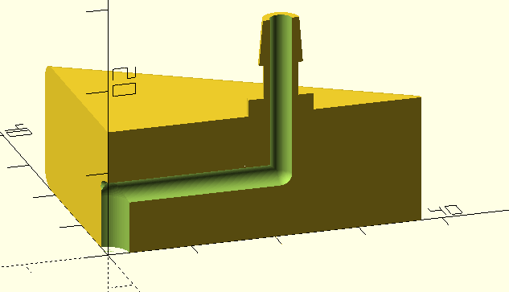

# Equipment for biology labs

This repository contains 3D printable parts for use in biology laboratories.

## Installation

Begin by cloning this repository and all its submodules using the following command:

````
git clone --recursive https://github.com/icaven/labware
````

Then use [OpenSCAD](https://www.openscad.org) to render files compatible with your 
printer's slicing software (such as .stl or .3mf).

Multi-nozzle suction head
-------

This part may be attached to a robot arm to pick up lids of petri dishes when connected to a 
vacuum pump.

The part has a [GoPro](https://www.thingiverse.com/search?q=gopro) compatible fitting 
 to join to the robot arm.


 

Bottom view

 

Cut away view showing air channel

 

Top view

Printed suction cups, made from a flexible material such as thermoplastic 
polyurethane (TPU), must be fitted onto each of the barbed nozzles.


By default, the design has three nozzles, but this is customisable.

