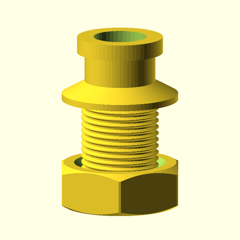
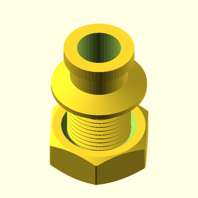
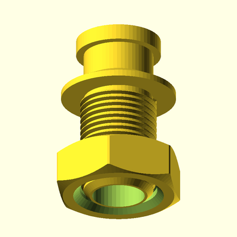
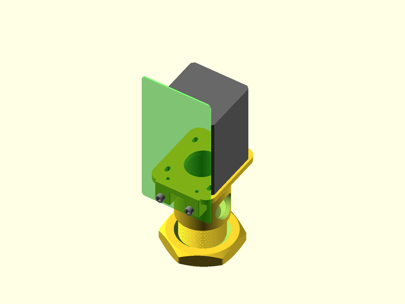
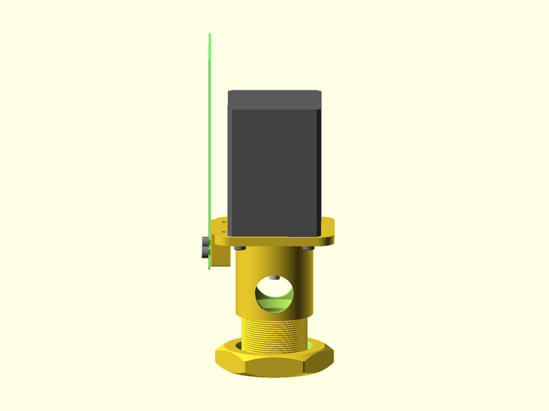
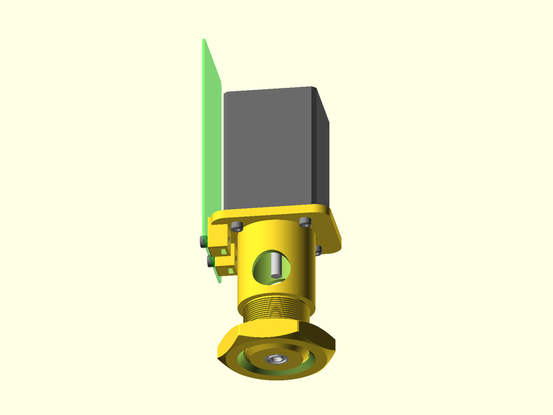
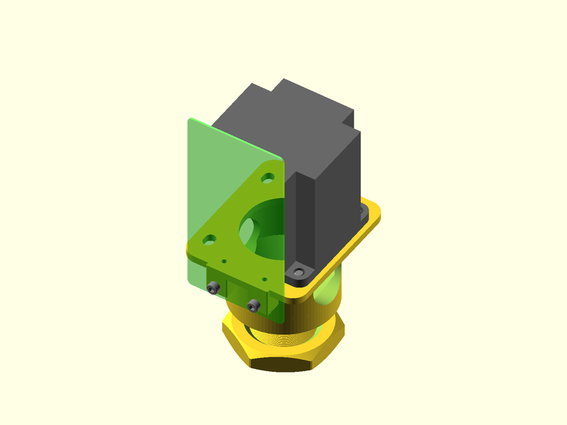
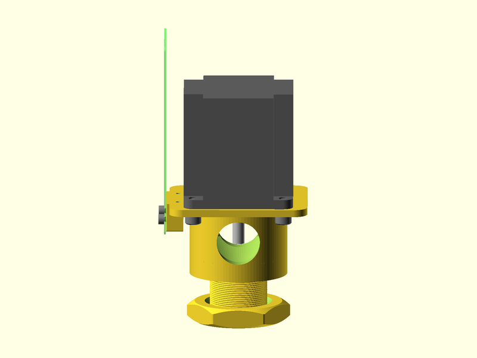
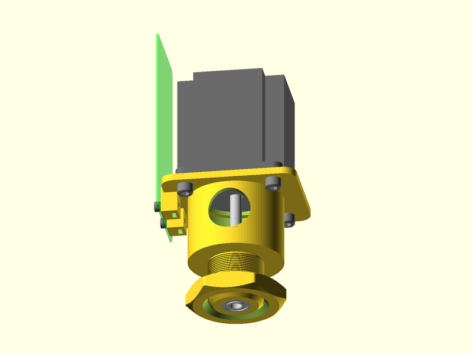

# Parts for a bioreactor

This directory contains parts designed with OpenSCAD that are used with a bioreactor.

## Septum holder

A septum is a rubber stopper, which seals a port into the bioreactor.  A metal cap is crimped
onto the top of the holder, fixing the septum in place.  

## Agitator motor mount

The impeller in the bioreactor is driven by a motor, and in this design a stepper motor is used.
Several motor sizes are supported: NEMA 11, 14, 17 and 23.  The design will automatically adapt
when a motor size is chosen.

The motor is controlled by a stepper motor driver board and a microprocessor.  These two electronic
components are mounted to the controller board plate which is attached with screws to the motor mount.
*The electronic design is not yet available.*

The following images show the motor mounts in the assembled configuration with additional parts, such
as the motor, screws, and the impeller shaft bearing.

The OpenSCAD preview of the assembly shows an "X-ray" view (like using a fluoroscope) of the top of the motor mount, showing
what is beneath the motor.

### NEMA 17 motor

### NEMA 23 motor

