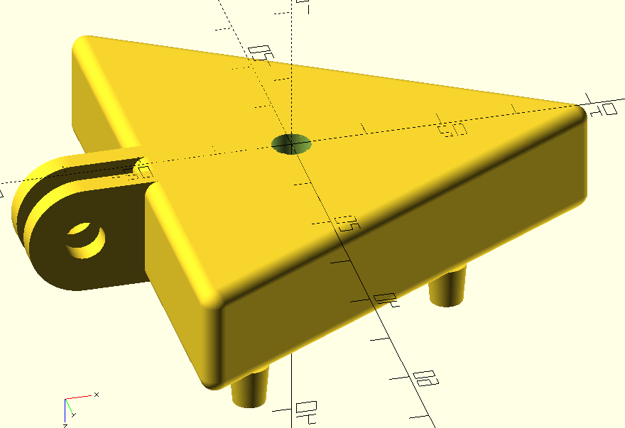

# Multi-nozzle suction head

This part may be attached to a robot arm to pick up lids of petri dishes when connected to a 
vacuum pump.

The part has a [GoPro](https://www.thingiverse.com/search?q=gopro) compatible fitting 
 to join to the robot arm.

By default, the design has three nozzles, but this is customisable.

 

Bottom view

 

Cut away view showing air channel

 

Top view

Print settings
----

The multi-nozzle was printed with the default parameter values using about 17 grams of PLA filament, at a layer height
of 0.15 mm and infill of 15%.  The heated bed temperature was 62 C for the first layer and 60 C afterward.  The print
time was 1 hour and 55 minutes.  The part is printed with the nozzles at the top of the print.

Suction cup
----

Printed suction cups, made from a flexible material such as thermoplastic 
polyurethane (TPU), must be fitted onto each of the barbed nozzles. 

_Some prints were made using TPU, and I found that the design needs some modifications are needed, so
this is still a work in progress._

